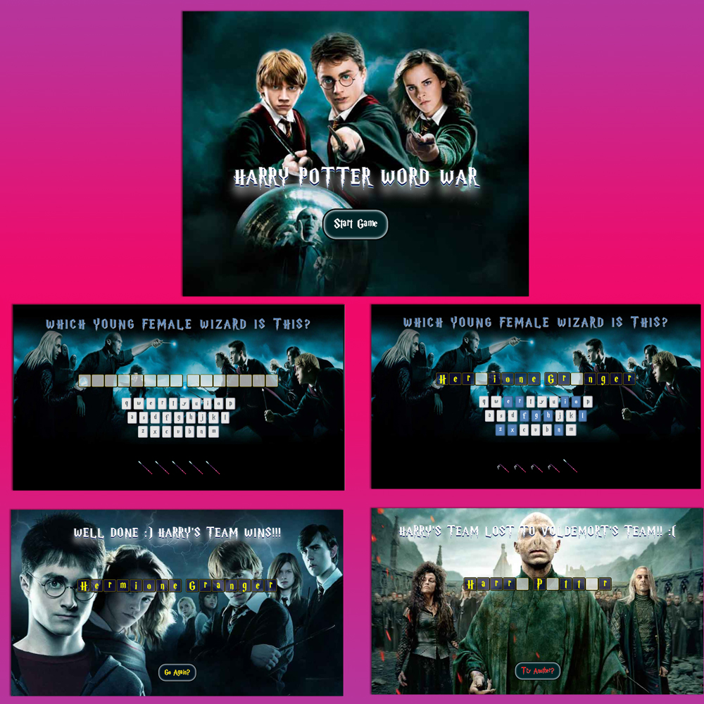

#  Treehouse FEWD TechDegree - Game Show App

This is my sixth project for the [Front End Web Development Techdegree at Treehouse](https://teamtreehouse.com/techdegree/front-end-web-development).

### Description
A word guessing game with 5 lives. The Harry Potter world was used as a theme.

## Table of contents
- [Overview](#overview)
  - [About this project](#about-this-project)
  - [Screenshot](#screenshot)
  - [Link](#links)
- [My Process](#my-process) 
  - [Technologies used](#technologies-used) 
  - [What I learned](#what-i-learned) 
  - [Continued development](#continued-development) 
  - [Useful resources](#useful-resources) 
- [Author](#author) 
- [Acknowledgments](#acknowledgments) 

## Overview
  
### About this project

Users should be able to: 
- Click on a start button to remove a start overlay.
- Click on a letter on the HTML keyboard to reveal a letter of the phrase.
- If a clicked keyboard letter is not in the phrase, a life is lost.
- If the user guesses the phrase, a winning overlay appears.
- If all lives are used up, a losing overlay appears.
- **Exceeds:** Transitions have been added to the phrase display.
- **Exceeds:** A button has been added to the “lose” and “win” overlays to reset the game

### Screenshot of my project 6 Game Show App

### Live Link
- Live Site URL: [Project 6 Harry Potter Themed Game Show App](https://samatkinsonmodeste.github.io/Project-6-HP-Game/)

## My Process

### Technoliges Used
-  CSS
- JavaScript

### What I Learned

I learned a lot of javascript doing this project:
- DOM Manipulation
- How to create an array of objects.
- How to create elements and insert them into the DOM.
- How to pass a function with data to another function.
- Event Listeners.
- Using the Console for Errors

I did find this project daunting, as it was the first time adding epic multiple lines of javascript to a project. 🙃  
However, the more lines of javascript I created that worked, the more excited I felt about javascript and part of the excitement was finally using javascript creatively. It was even fun using the console to understand my errors.

### Continued Development

In the future I would like to add:
- Audio, as in some Harry Potter music for different events.
- Add some media queries and start with a mobile-first approach.
- Possibly some animation with javascript.

### Resources
- [How to get Last Element of an Array in Javascript?](https://flaviocopes.com/how-to-get-last-item-array-javascript/) - This helped me understand how to get the last element in an array when you don't know how many items are in an array.

## Author
- Team Treehouse - [samanthaatkinson](https://www.teamtreehouse.com/samanthaatkinson)
- Twitter - [@sammodeste1](https://www.twitter.com/@sammodeste1)
- LinkedIn - [sam-atkinson-modeste](https://www.linkedin.com/<<sam-atkinson-modeste>>)
- GitHub - [SamAtkinsonModeste](https://www.github.com/SamAtkinsonModeste)

## Acknowledgments
- [Brian Jensen](https://teamtreehouse.com/brianjensen) our Student Success Lead  
He gave me a lot of support and helped me find my confidence with Javascript.

